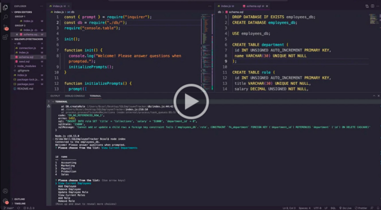

# SQLEmployeeTracker

Challenge 12. This application is a command-line application from scratch to manage a company's employee database, using Node.js, Inquirer, and MySQL.

## User Story

```md
AS A business owner
I WANT to be able to view and manage the departments, roles, and employees in my company
SO THAT I can organize and plan my business
```

## Usage

* To start the application, please follow the below instructions:

* Open the terminal in the app directory and enter: 
    ```md
    npm i
    ```
* Start MySQL server and source the app database by entering: 
    ```md
    mysql -u root -p
    ```
* Once MySQL starts, source your database and any seeded data with the following commands:
    ```md
    source db/schema.sql
    source db/seed.sql
    ```        
* Those entries should return that the database changed and whether the queries and rows are returning.
* Exit MySQL by entering:
    ```md
    exit
    ```
* Start the application via the script provided in the package.json file:
    * Into the command line, enter:
    ```md
    node index
    ```
    *This should start the app in the command line with the menu for users to navigate via the keyboard arrows and enter button with the following message:
     ```md
    Connected to the employees_db.
    Welcome! Please answer questions when prompted.
    ? Please choose from the list: 
    ```
* Exit the application by selecting the 'Exit' option in the listed menu.

## Mock-Up
The following video demonstrates the application being used from the command line:

[](https://drive.google.com/file/d/147ZbWF34Yqr6gkDberrsFOiX22CYEe5U/view)

## Acceptance Criteria

```md
GIVEN a command-line application that accepts user input
WHEN I start the application
THEN I am presented with the following options: view all departments, view all roles, view all employees, add a department, add a role, add an employee, and update an employee role
WHEN I choose to view all departments
THEN I am presented with a formatted table showing department names and department ids
WHEN I choose to view all roles
THEN I am presented with the job title, role id, the department that role belongs to, and the salary for that role
WHEN I choose to view all employees
THEN I am presented with a formatted table showing employee data, including employee ids, first names, last names, job titles, departments, salaries, and managers that the employees report to
WHEN I choose to add a department
THEN I am prompted to enter the name of the department and that department is added to the database
WHEN I choose to add a role
THEN I am prompted to enter the name, salary, and department for the role and that role is added to the database
WHEN I choose to add an employee
THEN I am prompted to enter the employee’s first name, last name, role, and manager, and that employee is added to the database
WHEN I choose to update an employee role
THEN I am prompted to select an employee to update and their new role and this information is updated in the database 
```
## Contributing

Pull requests are welcome. For major changes, please open an issue first
to discuss what you would like to change.

Please make sure to update tests as appropriate.

## License
